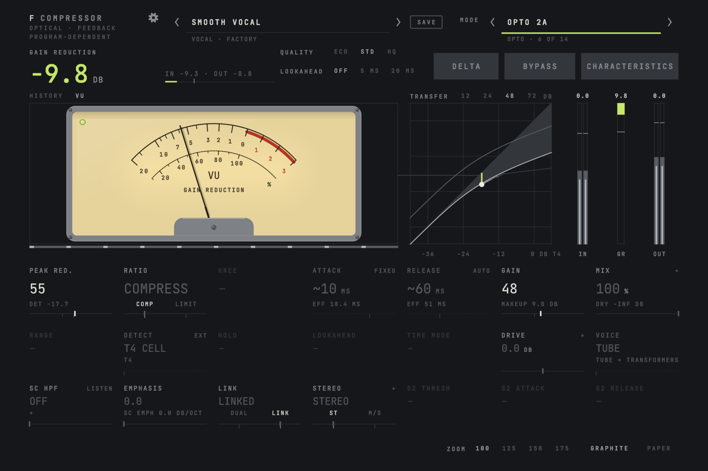

# FCompressor

[](https://github.com/Snipet/FCompressor/actions/workflows/ci.yml)


[](LICENSE)

An all-in-one compressor plugin for macOS and Linux. Fourteen compressor types, called **Modes**, share one interface:
the same controls in the same places for every Mode, with a Mode free to lock a control or restrict it to its hardware's
steps. Everything the display draws (the transfer curve, the operating point, the gain-reduction history, the meters) is
computed by the same code the audio runs, and the test suite checks that it matches.



## Modes

| Mode | What it is |
| --- | --- |
| Clean | A transparent digital compressor, with optional tube, diode or bright colour |
| Bus G | A VCA bus compressor with stepped ratios |
| FET 76 | A feedback FET limiter |
| Opto 2A | A tube optical leveller |
| Mu 67 | A variable-mu tube limiter whose ratio rises with level |
| Diode 609 | A diode-bridge compressor and limiter |
| Bus 25 | A VCA bus compressor that runs feed-forward or feedback |
| Brickwall | A lookahead true-peak limiter |
| Octo | A hybrid VCA compressor with distortion, up to NUKE |
| Console E | A console channel's VCA compressor |
| Opto 3A | A solid-state optical compressor |
| Diode 54 | A diode-bridge compressor with a fast-attack option |
| Mu Mastering | A variable-mu mastering compressor and limiter |
| Opto Tube 1B | A tube optical compressor with manual or fixed timing |

Each Mode has its own factory presets, and `docs/modes/` has a sheet per Mode: what it runs, every modelling constant
with its source, and its measurements.

## Features

- **One interface for every Mode.** Switching Mode keeps your automation meaningful and crossfades the sound.
- **A display you can trust:** transfer curve with the live operating point, gain-reduction history, a VU or hardware
  meter face per Mode, and a Characteristics screen with the detector, the side chain and the colour stage.
- **Side chain:** high-pass, tilt emphasis, external key and listen; stereo link and mid/side modes.
- **Mix to 200 %**, delta (hear what the compressor removes), auto makeup, lookahead up to 20 ms, and oversampling at
  three qualities (ECO, STD, HQ).
- **Presets:** a factory bank per Mode, user presets with categories, import and export.
- **Settings and diagnostics:** audio settings with their costs in latency, defaults for new instances, and a DSP load
  and host report you can copy.
- **Zoom** from 100 to 175 %, graphite and paper themes, full keyboard control and screen-reader support.
- **Real-time safe:** no allocation, lock or system call on the audio thread, and the same output at any block size.

## Building

Requirements: macOS 14 or later on Apple Silicon, Xcode (Apple clang with C++20), CMake 3.30 or later, Ninja, git and
Python 3. JUCE, bgfx and FunkGui are fetched at pinned versions during configure.

```sh
git clone https://github.com/Snipet/FCompressor.git
cd FCompressor
cmake --preset owner && cmake --build --preset owner   # Release; installs into ~/Library/Audio/Plug-Ins
```

`Scripts/deps.sh` optionally caches JUCE, bgfx and a prebuilt shader compiler in `~/audio/.deps`, so new build
directories skip the downloads and the shader-compiler build.

### Linux

Linux builds the VST3 and the Standalone (there is no AU) on x86-64 with Clang, from the same presets. JUCE's windows
are X11 windows, so on a Wayland desktop the editor runs through XWayland, as every JUCE plugin and the Linux hosts that
embed them do. The editor draws with Vulkan; without a Vulkan driver it shows a "GPU renderer unavailable" screen while
the audio keeps working.

```sh
# Debian / Ubuntu (24.04 or later); other distributions have the same packages under their own names
sudo apt install clang cmake ninja-build pkg-config git python3 \
  libasound2-dev libfreetype-dev libfontconfig1-dev libglib2.0-dev libsqlite3-dev \
  libx11-dev libxext-dev libxrandr-dev libxinerama-dev libxcursor-dev libxrender-dev libxcomposite-dev \
  libgl-dev libegl-dev
cmake --preset owner && cmake --build --preset owner   # Release; installs the VST3 into ~/.vst3
```

The Standalone is `build/FCompressor_artefacts/Release/Standalone/FCompressor`. Clang is the default compiler on Linux
(set `CC`/`CXX` to choose another Clang); preferences and presets live in `~/.config/FCompressor/`.

## Testing

Every probe is a CTest test, and `Scripts/verify.sh` classifies the results against the blessed goldens:

```sh
cmake --workflow --preset dsp-verify                  # the DSP library alone, no JUCE
cmake --workflow --preset agent-verify                # the headless plugin and every probe
Scripts/verify.sh build-agent                         # the pass/fail gate
```

CI runs the DSP library and the shipping configuration (GPU editor, Release, LTO) through the same gate on every push
and pull request, on Apple Silicon and on x86-64 Linux, against the same goldens.

## Repository map

```
Source/fcdsp/      the JUCE-free DSP library: core, parameters, engine, telemetry, analysis, one directory per Mode
Source/plugin/     the JUCE processor, state and presets
Source/editor/     the panel and its views (+ gpu/ for the bgfx editor)
Tools/probes/      the test probes, one self-registering file each
tests/golden/      the blessed golden results; tests/fixtures/ write-once fixtures
Scripts/           deps.sh, verify.sh, validate.sh, golden.py, release.sh, gui-live.sh
docs/              ARCHITECTURE.md, DECISIONS.md, the design appendices, the sprint records, the Mode sheets
```

The GUI library, [FunkGui](https://github.com/Snipet/FunkGui), is a separate repository consumed at a pinned tag.

## Documentation

- [`docs/ARCHITECTURE.md`](docs/ARCHITECTURE.md): modules, data flow, Modes, UI, threading, latency, state and testing.
- [`docs/DECISIONS.md`](docs/DECISIONS.md): every design decision (ADR-nn) with its reasons.
- [`docs/modes/`](docs/modes/): one sheet per Mode.
- [`docs/design/`](docs/design/): the binding contracts for the core, the UI and the build.

## Licence

FCompressor is GPL-3.0 ([`LICENSE`](LICENSE)). It builds on [JUCE 8](https://juce.com) (fetched under its open-source
AGPLv3 licence), [bgfx](https://github.com/bkaradzic/bgfx) (BSD-2-Clause) and FunkGui (GPL-3.0).

The Mode names describe circuit families. Product names mentioned in the documentation are trademarks of their owners;
FCompressor is not affiliated with or endorsed by them.
